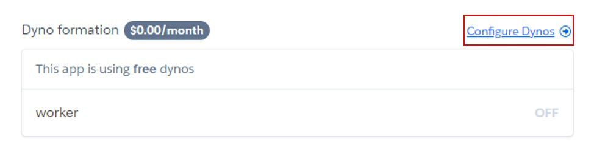
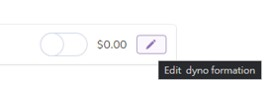

# Heroku

## Installation

The Heroku requires Git, if you don't already have Git installed, please finish installed Git before installing the Heroku.

Download and install the [**Heroku**](https://devcenter.heroku.com/articles/heroku-cli).

## Sign up Heroku

> [**Sign up**](https://signup.heroku.com/dc) for free and experience Heroku today.

## Quick Start

If you haven't already, log in to your Heroku account and follow the prompts to create a new SSH public key.

```zsh
heroku login
```

In your project folder, create heroku app.

```zsh
git init
heroku create [your_app_name]
heroku git:remote --app <YOUR_APP_NAME>
```

Deploy your changes.

```zsh
git add .
git commit -m "[message]"
git push heroku master
```

If this project is the first time, [**log in**](https://id.heroku.com/login) your Heroku, and go to your Heroku project ([**https://dashboard.heroku.com/apps/your_app_name**](https://dashboard.heroku.com/apps))

1. Click configure dynos.

    

2. Click edit dyno.

    

3. Open switch and confirm.

    

